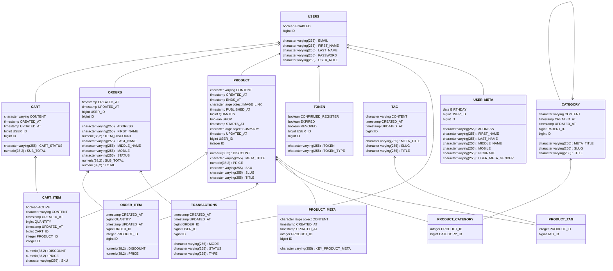

# Web Team 7
----------

## Contributors 
- Bùi Ngọc Dũng B21DCTC031
- Nguyễn Vương Đoàn B21DCTC029
- Lê Hải Đăng B21DCTC027
- Trần Văn Hùng B21DCTC047
- Chu Văn Mạnh B21DCTC068
- Nguyễn Cường Minh B21DCTC009

